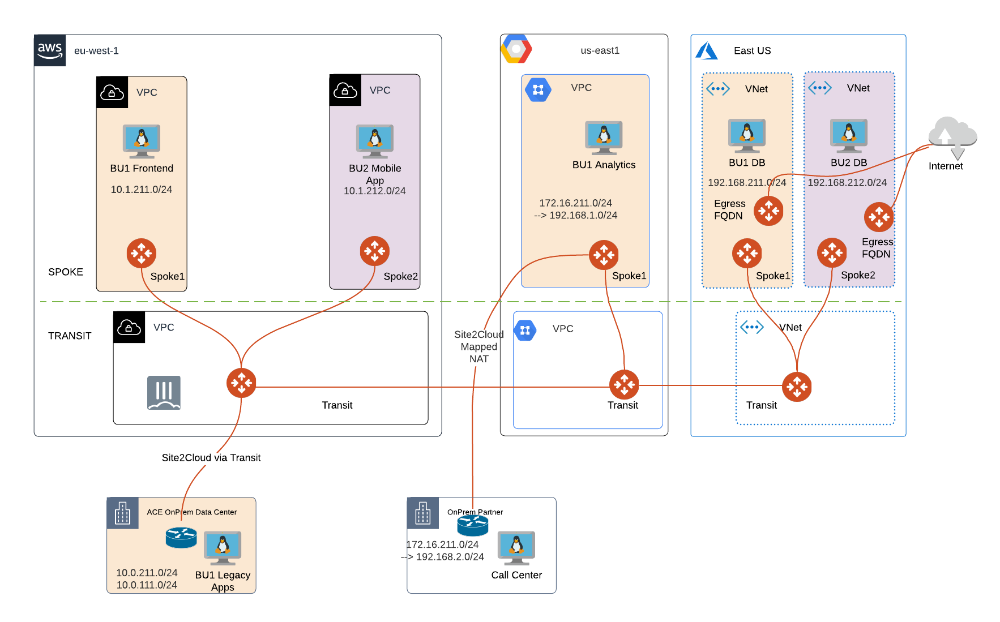

# ACE Cloud Ops Infrastructure

### Summary

This repository builds out a __completed__ representation of the infrastructure created for the ACE Cloud Ops course.

It builds the following:

- Aviatrix Transit FireNet in AWS (with Check Point Firewall) with 2 spokes
- Aviatrix Transit in Azure with 2 spokes
- Aviatrix Transit in GCP with 1 spoke
- Ubuntu VMs with password authentication (1 per spoke)
- Multi-Cloud Segmentation (2 security domains)
- Site2Cloud with On-Prem Cisco CSR emulated in AWS



Component | Version
--- | ---
Aviatrix Controller | UserConnect-6.2.1955 (6.2)
Aviatrix Terraform Provider | 2.17.1
Terraform | 0.12
Azure Terraform Provider | 2.30
GCP Terraform Provider | 3.49
AWS Terraform Provider | 3.19

### Dependencies

- Software version requirements met
- Aviatrix Controller with Access Accounts defined for AWS, Azure, and GCP
- Sufficient limits in place for CSPs and regions in scope **_(EIPs, Compute quotas, etc.)_**
- Active subscriptions for the NGFW firewall images in scope
- terraform .12 in the user environment ```terraform -v```
- Terraform provider requirements are met (AWS, GCP, Azure) in the runtime environment
- Account credentials for each CSP defined in environment

### Workflow

- Modify ```terraform.tfvars``` if needed
- ```terraform init```
- ```terraform plan```
- ```terraform apply --auto-approve```